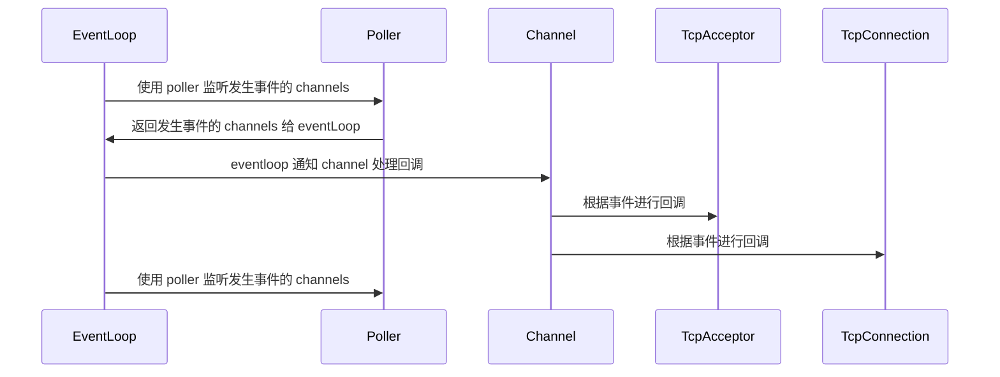

# Reactor 模式的 IO 多路复用

一个典型的 Reactor 系统有几个核心组件：

| 组件									| 作用                         |
| -----------------						| -------------------------- |
| **Reactor (EventLoop)**             	| 事件循环，监听事件源并分发事件            |
| **Demultiplexer (epoll)**       		| I/O 多路复用工具（select、epoll 等） |
| **Handle (Connection)**              	| 事件源的抽象，比如 socket 连接        |
| **Event Handler (EventHandler)**      | 事件处理器，真正处理业务逻辑             |

工作流程：

1. Reactor 进行事件循环（通过使用 epoll 等 IO 多路复用工具）。
2. Demultiplexer 检测到某个 Handle 上有事件发生。
3. Reactor 调用对应的 handle_event 来处理。
4. Connection 调用回调函数，处理具体的业务逻辑（EventHandler 封装好的业务逻辑函数）。