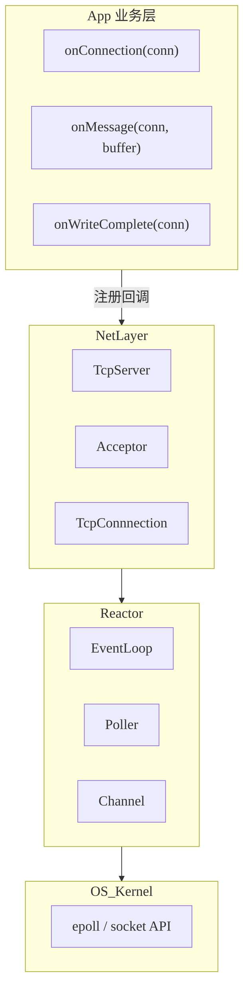
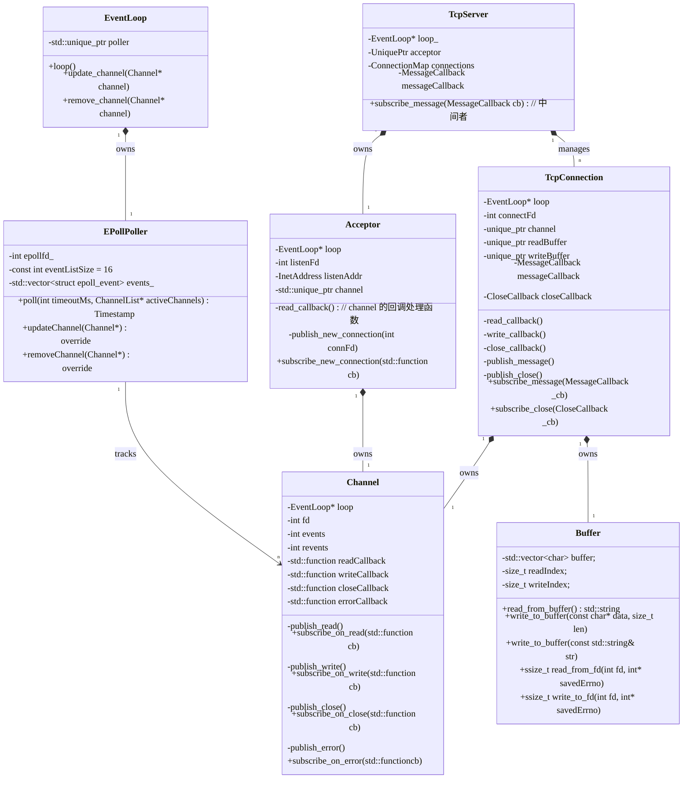
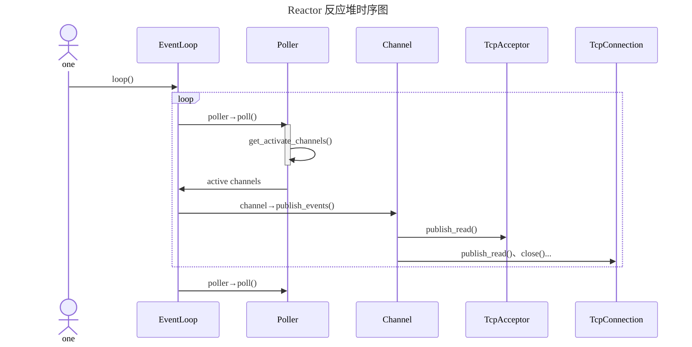
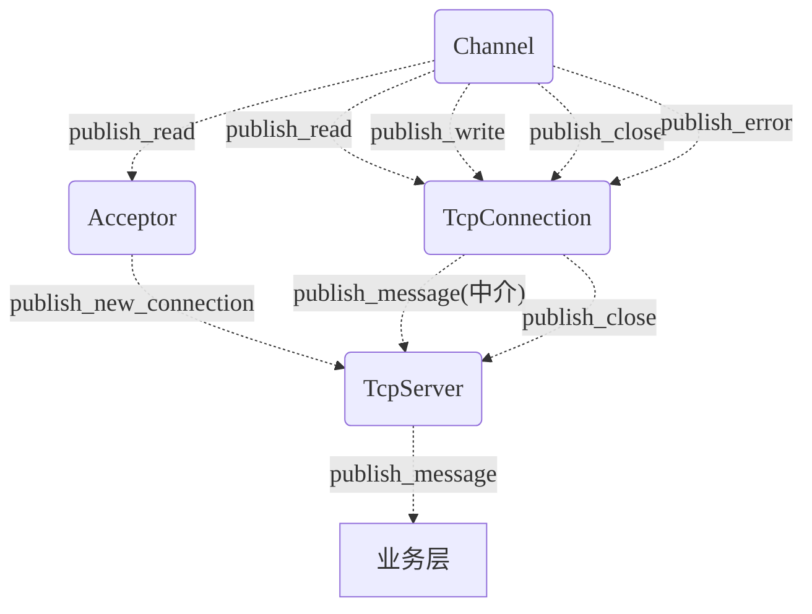

# Reactor 模式的 IO 多路复用

## Reactor 模式

## 系统架构图

```mermaid

%%{init: {
    "theme": "default",
    "themeVariables": {
        "fontFamily": "Times New Roman",
        "fontSize": "20px"
    }
}}%%

flowchart TD
    subgraph AppBusiness[App 业务层]
        onConn["onConnection(conn)"]
        onMsg["onMessage(conn, buffer)"]
        onWrite["onWriteComplete(conn)"]
    end

    subgraph NetLayer
        TcpServer
        Acceptor
        TcpConnnection

        %% Buffer
        %% TcpServer --> Acceptor 
        %% TcpServer --> TcpConnnection
        %% TcpConnnection -.-> Buffer
    end

    subgraph Reactor
        EventLoop
        Poller
        Channel
    end

    subgraph OS_Kernel
        epoll["epoll / socket API"]
    end

    %% 应用层注册回调
    %% AppBusiness -->|注册回调| TcpServer
    AppBusiness -->|注册回调| NetLayer
    NetLayer --> Reactor
    Reactor --> OS_Kernel
    %% TcpConnnection --> Channel --> EventLoop --> Poller --> epoll
    %% AppBusiness --> NetLayer --> Reactor --> OS_Kernel

```

## UML 类图

```mermaid

%%{init: {
    "theme": "default",
    "themeVariables": {
        "fontFamily": "Times New Roman",
        "fontSize": "20px"
    }
}}%%

classDiagram
    direction TD

    subgraph Reactor 核心
        class EventLoop {
            -std::unique_ptr<Poller> poller
            +loop()
            +update_channel(Channel* channel)
            +remove_channel(Channel* channel)
        }

        class EPollPoller {
            -int epollfd_
            -const int eventListSize = 16
            -std::vector~struct epoll_event~ events_
            +poll(int timeoutMs, ChannelList* activeChannels) Timestamp
            +updateChannel(Channel*) override
            +removeChannel(Channel*) override
        }

        class Channel {
            -EventLoop* loop
            -int fd
            -int events
            -int revents
            -std::function readCallback
            -std::function writeCallback
            -std::function closeCallback
            -std::function errorCallback
            
            -publish_read()
            +subscribe_on_read(std::function cb)
            -publish_write()
            +subscribe_on_write(std::function cb)
            -publish_close()
            +subscribe_on_close(std::function cb)
            -publish_error()
            +subscribe_on_error(std::functioncb)
        }
    end

    subgraph TCP 网络层
        class TcpServer {
            -EventLoop* loop_
            -UniquePtr acceptor
            -ConnectionMap connections
            
            -MessageCallback messageCallback
            
            +subscribe_message(MessageCallback cb) // 中间者
        }
        
        class Acceptor {
            -EventLoop* loop
            -int listenFd
            -InetAddress listenAddr
            -std::unique_ptr<Channel> channel
            
            -read_callback() // channel 的回调处理函数
            -publish_new_connection(int connFd)
            +subscribe_new_connection(std::function cb)
        }

        class TcpConnection {
            -EventLoop* loop
            -int connectFd
            -unique_ptr channel
            -unique_ptr readBuffer
            -unique_ptr writeBuffer
            
            -MessageCallback messageCallback
            -CloseCallback closeCallback
            
            -read_callback()
            -write_callback()
            -close_callback()
            
            -publish_message()
            -publish_close()
            +subscribe_message(MessageCallback _cb)
            +subscribe_close(CloseCallback _cb)
        }

        class Buffer {
            -std::vector~char~ buffer;
            -size_t readIndex;
            -size_t writeIndex;

            +read_from_buffer() std::string 
            +write_to_buffer(const char* data, size_t len)
            +write_to_buffer(const std::string& str)

            +ssize_t read_from_fd(int fd, int* savedErrno)
            +ssize_t write_to_fd(int fd, int* savedErrno)
        }
    end

    %% -- 继承关系 --
    
    %% -- 组合/聚合关系 (拥有) --
    EventLoop "1" *-- "1" EPollPoller: owns
    EPollPoller "1" --> "n" Channel: tracks
    
    Acceptor "1" *-- "1" Channel: owns
    TcpConnection "1" *-- "1" Channel: owns
    TcpConnection "1" *-- "1" Buffer: owns
    
    TcpServer "1" *-- "1" Acceptor: owns
    TcpServer "1" *-- "n" TcpConnection: manages

```

## Reactor 模块时序图

```mermaid

%% %% 示例：在代码块顶部配置主题变量
%% %%{init: {'theme':'forest'}}%%
%% sequenceDiagram

%%     participant EventLoop
%%     participant Poller
%%     participant Channel
%%     participant TcpAcceptor
%%     participant TcpConnection
	
%% 	EventLoop->>Poller: 使用 poller 监听发生事件的 channels
%% 	Poller->>EventLoop: 返回发生事件的 channels 给 eventLoop
%% 	EventLoop->>Channel: eventloop 通知 channel 处理回调
%% 	Channel->> TcpAcceptor: 根据事件进行回调
%% 	Channel->> TcpConnection: 根据事件进行回调
%% 	EventLoop->>Poller: 使用 poller 监听发生事件的 channels

%%{init: {
    "theme": "default",
    "themeVariables": {
        "fontFamily": "Times New Roman",
        "fontSize": "20px"
    }
}}%%

sequenceDiagram
    title Reactor 反应堆时序图
    
    actor one
    participant EventLoop
    participant Poller
    participant Channel
    participant TcpAcceptor
    participant TcpConnection
	
    one ->> EventLoop: loop()
    loop
	EventLoop->>Poller: poller→poll()

    activate Poller
    Poller->>Poller: get_activate_channels()
    deactivate Poller
    
    Poller->>EventLoop: active channels
	EventLoop->>Channel: channel→publish_events()
	Channel->> TcpAcceptor: publish_read()
	Channel->> TcpConnection: publish_read()、close()...
    end
	EventLoop->>Poller: poller→poll()

```

## Callback 流向图

```mermaid

%%{init: {
    "theme": "default",
    "themeVariables": {
        "fontFamily": "Times New Roman",
        "fontSize": "20px"
    }
}}%%
graph TD
    %% 定义发布者节点
    Channel(Channel)
    Acceptor(Acceptor)
    TcpConnection(TcpConnection)
    TcpServer(TcpServer)


    Channel -.publish_read.-> Acceptor
    Channel -.publish_read.-> TcpConnection
    Channel -.publish_write.-> TcpConnection
    Channel -.publish_close.-> TcpConnection
    Channel -.publish_error.-> TcpConnection
    
    Acceptor -.publish_new_connection.-> TcpServer
    TcpConnection -.publish_message(中介).-> TcpServer
    TcpConnection -.publish_close.-> TcpServer
    
    TcpServer -.publish_message.-> 业务层

```
